This page contains background on modeling river evolution using information on channel geomorphology. If you'd like to cut to the chase, you can find the <a href="https://github.com/morphed">code behind the MoRPHED model here</a>.

If you measure the topography and bathymetry of a river precisely, using tools like high-resolution GPS, laser scanners, and structure-from-motion photogrammetry, you’ll start to discern some order from an initially chaotic appearance. In particular, you’ll notice that areas where sediment gets deposited, or bars, don’t occur randomly. Instead, they exhibit a fairly regular spacing as you move downstream. Here’s an example from a large braided river in New Zealand, but this sort of thing happens in single-thread meandering streams as well.

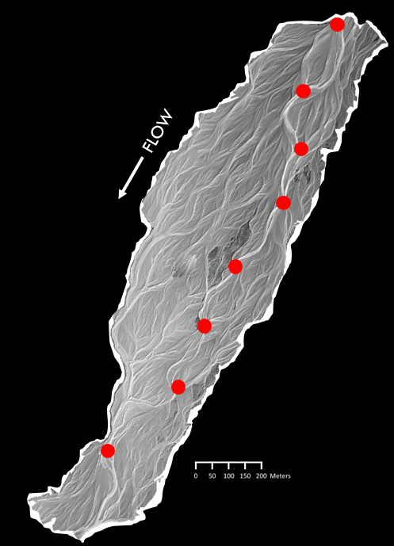

*A digital elevation model of the River Rees in New Zealand (data courtesy of <a href="http://www.geog.qmul.ac.uk/staff/brasingtonj.html" target="_blank"> James Brasington, Queen Mary University of London</a>). Note the regularity with which flow divergences occur, shown in red; these mark the upstream edge of a series of mid-channel bars.*

In the field and in laboratory flumes, many geomorphologists have noticed that these bars are typically where they find particles deposited after a flood. In 2009, researchers at the University of Western Ontario hypothesized that the average spacing between bars might be a predictor of the average particle travel distance during a flood, or the particles’ "path lengths."

If that hypothesis is true, it gives us a chance to address sediment transport in a very simple way. That is, we can predict sediment dynamics and, through time, channel evolution just by examining the spacing of channel bars? I’ve spent the last several years testing this hypothesized form-process linkage and its implications in gravel-bed braided rivers in the laboratory and in the field.

I first sought to test the hypothesis described above, that particle travel distances during floods are mirrored by the average spacing between bars. Working with <a href="http://geography.uwo.ca/people/faculty/ashmore_peter.html" target="_blank"> Peter Ashmore </a> and <a href="http://grad.uwo.ca/profiles/speirce.html" target="_blank"> Sarah Peirce </a> at the University of Western Ontario and with <a href="http://www.joewheaton.org" target="_blank"> Joe Wheaton </a> and James Hensleigh at Utah State University, I conducted laboratory flume experiments at the University of Western Ontario.                   

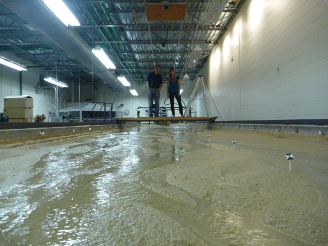

*The flume at the University of Western Ontario, looking upstream, with Peter Ashmore and Sarah Peirce for scale.*

To characterize the form of the channel before and after simulated floods, we captured photos from a camera mounted above the flume and extracted elevation data using structure-from-motion photogrammetry. The resolution of the datasets we were able to produce was on the millimeter scale, meaning we could detect the motion of single grains of sand on the flume bed. It's the first time I'm aware of that SfM has been used at such a fine resolution in a flume setting.

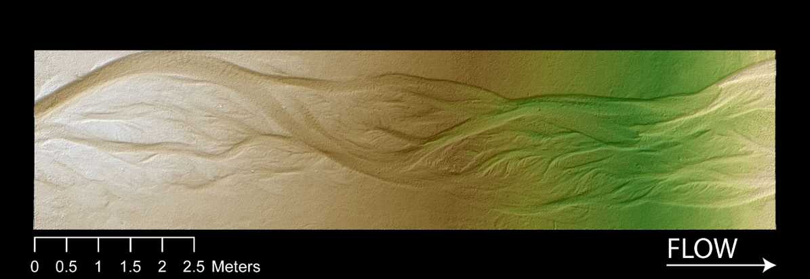

*A digital elevation model of the flume produced using structure-from-motion; pixel size is 3 millimeters.*

To get a handle on particle travel distances during floods, we measured the average transport distance of marked particles during simulated floods. Particles were placed into the flow, and their initial locations marked. For the particles that we recovered after each of five floods, we measured their downstream travel distance.

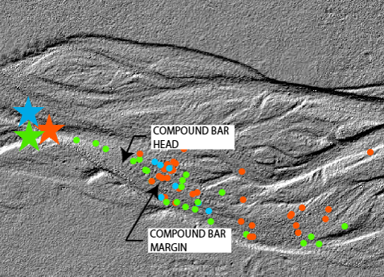

*Locations where we recovered tracers of three different colors are shown in dots, and the locations where they were put into the flow are shown in starts. Note the clustering of deposition around the mid-channel compound bar in the center of the DEM. Flow is from left to right.*

I found that particle travel distance, or path length, indeed closely mirrored the mean bar spacing through the flume during my experiments, confirming our initial hypothesis. The results of the work were published in the <a href="http://onlinelibrary.wiley.com/doi/10.1002/2014JF003310/abstract" target="_blank"> Journal of Geophysical Research: Earth Surface</a>. The finding that we can approximate particle path lengths by measuring channel morphology has implications for the way we predict channel evolution during floods, especially by using morphodynamic models.

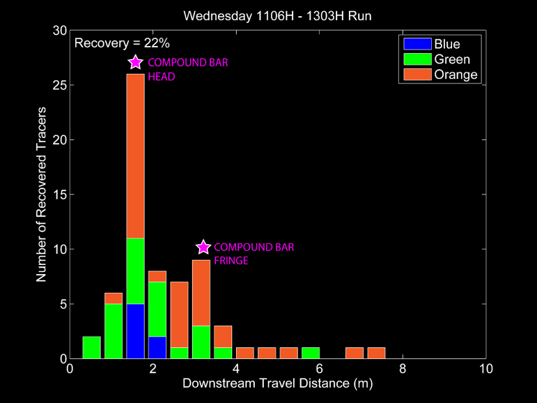

*Plot of particle travel distances for three colors of tracers from one flume run. The recovered tracers are shown in the DEM above. Note peak in  travel distance that corresponds with the mid-channel bar.* 

**Using Path Lengths to Model River Evolution**

Braided rivers are complex and dynamic systems, marked by a continually shifting network of channels diverging and converging around bars. Several factors, including high rates of sediment supply, high channel slope, and readily erodible banks can lead to a braided channel planform. Due in large part to (and perhaps in spite of) their dynamic nature, braided streams comprise vital habitat to numerous fish and aquatic organisms.

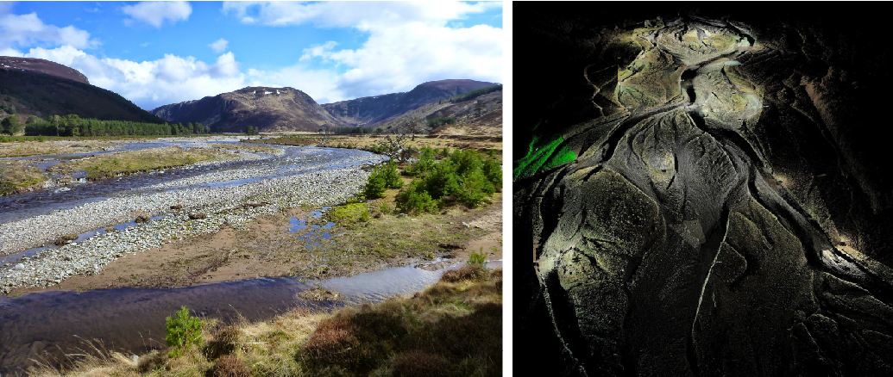

*Two ways of looking at the River Feshie, one of our study sites for this project. Left, a photo looking upstream. Right, a laser-scanning point cloud (~250 million points) looking upstream.*

Given the sensitivity of braided rivers to floods, which may completely rearrange channel form in a matter of hours to days, it's reasonable to wonder what effect human factors (such as climate change and land use), which can alter flood size and frequency and/or the amount of sediment delivered to these streams, might have on the form of these streams and their associated habitat. In cases like this, we can turn to field work to document the effect of numerous floods and infer the different mechanisms by which they alter channel form. But given that flood/sediment influencing factors, such as climate change, might take decades to centuries to manifest, it would take many years of field work to understand these mechanisms of change.

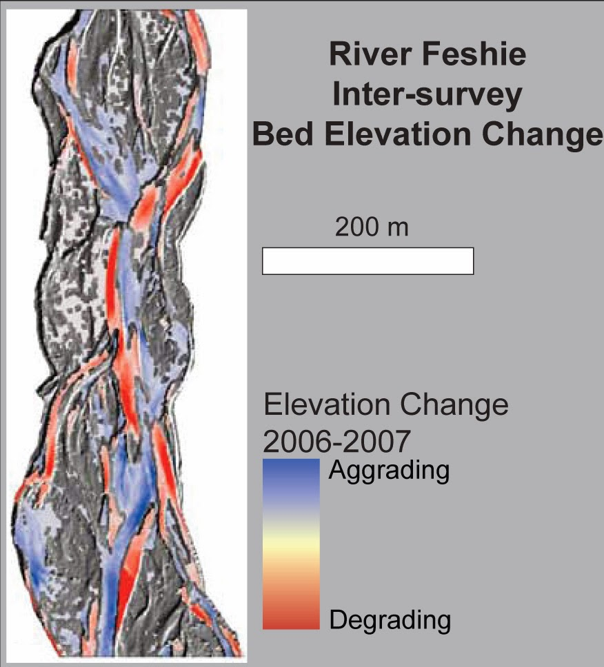

*Bed elevation change on the River Feshie from 2006 to 2007, resulting from one year of floods.*

In such instances, we can turn to modeling as a tool with which to predict the form of braided rivers in response to shifting water and sediment inputs. Unfortunately such long-term predictions (10's-100's of years) that document channel change can be taxing on even powerful computers, given that they need to track individual grains of sediment as they move through the system, and perform a great deal of accounting to compute channel bed change through time (a concept we refer to as morphodynamics).

One way to deal with the inherent complexity of modeling braided rivers is to experiment with novel ways for computing sediment transport. Rather than tracking each particle as it moves downstream, we are developing morphodynamic models based on sediment 'path-lengths,' which are simply distributions of how far particles are moving once they are eroded in a flood. In another research project, I showed that these path-lengths were closely coupled, and could be approximated by, the spacing between bars in a braided river. To put it simply, particles often 'hop' from one bar to the next during a flood.

In practical terms, the existence of path-lengths during floods means that the time step of our model isn't a second/minute/hour, but rather is one flood. We intend to undertake tracer experiments on study streams in the UK and the US which have potential to provide field-calibrated path-length distributions. These distributions have been found by numerous researchers in flume and field work, but have not been widely incorporated into our models.

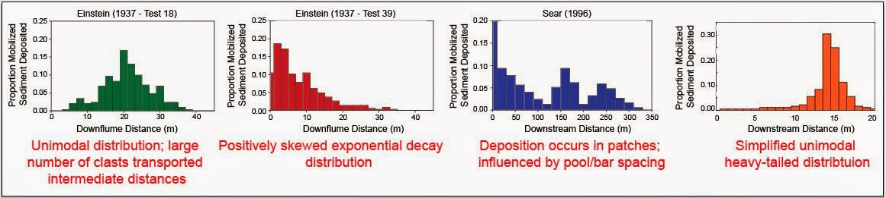

*Several empirical and theoretically-derived path-length distributions for particle travel distances.*

The upshot of using a path-length-based approach for modeling sediment transport is that it reduces the computational power necessary for morphodynamic modeling, since we're not tracking every grain of sediment during a flood; this allows us to model longer timespans, and to do so at high resolution - the scale of individual channel pools and bars which comprise local habitat for organisms in braided rivers.

The model we've developed is called the <a href="http://morphed.joewheaton.org" target="_blank"> Model of Riverine Physical Habitat and Ecogeomorphic Dynamics, or MoRPHED</a>. We've been using it, in concert with the Delft3D hydraulic model, to simulate channel evolution over timescales ranging from a single flood to decades on two braided rivers in New Zealand and Scotland. A couple snapshots of model results are shown below, for a one-year period comprising twelve modeled floods.

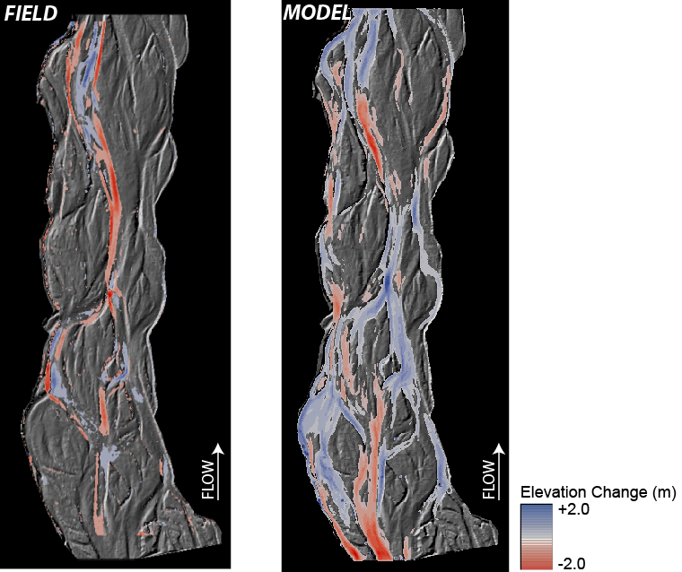

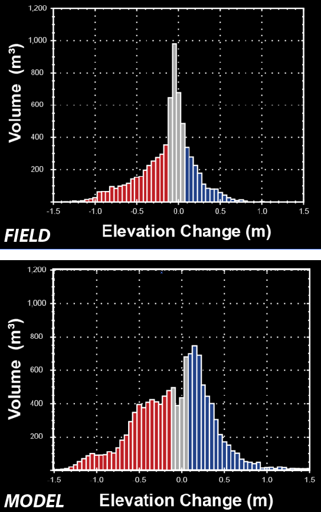

*The same comparison of field (left) and model (right) DEMs-of-Difference over a one-year period (12 floods) on the River Feshie, Scotland - instead using elevation change distributions to depict the volume of erosion (red) and deposition (blue).*

**Using the Model to better Understand Sediment Delivery to Channels and its Influence on Channel Form**

In addition to my ongoing research into how sediment moves through rivers and whether that's linked to channel morphology, I'm interested in the factors that drive sediment delivery to streams. This interest actually started back in my master's program, where I looked at <a href="http://www.sciencedirect.com/science/article/pii/S0169555X12005545" target="_blank"> fine sediment in New England streams</a> and whether that could be related to the amount of upstream timber harvest that had recently occurred. It turned out that while we couldn't detect more fine sediment in the stream channel downstream of heavily-logged areas (using traditional methods like pebble counts or embeddedness surveys), we did find that the fines in those areas had been delivered more recently to channels, by measuring the amount of lead-210 in stream sediments.

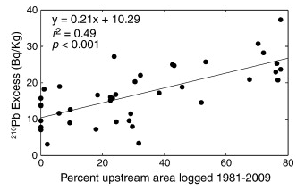

*More upstream timber harvest, more lead-210, more recently delivered sediment. Figure is from Kasprak et al., 2013.*

We hypothesized that the reason for this was in part due to the low-gradient nature of the landscape: while more fines might have been delivered to channels following timber harvest, that delivery just wasn't rapid enough or of a high enough magnitude to allow for us to detect lots of fine sediment on streambeds, and instead either remained in place or were stored in sinks on the floodplain or valley floor. Given the tools geomorphologists have at their disposal to analyze the form of landscapes, I'm interested in testing these hypotheses and determining which landform characteristics lend themselves to channel-hillslope connectivity and greater potential for land use to drive sediment delivery to streams.

But what happens when that sediment reaches the channel? As part of my Ph.D. work, I wanted to examine what the influence of sediment supply, and delivery timing, would be on braided channel morphology. So along with collaborators at Utah State University and in the UK, I employed the MoRPHED model I designed to conduct scenario-based modeling on the River Feshie in Scotland. Specifically, we modeled four sediment supply scenarios over a ten-year period on the Feshie (with 185 competent floods), which are shown in the table below.

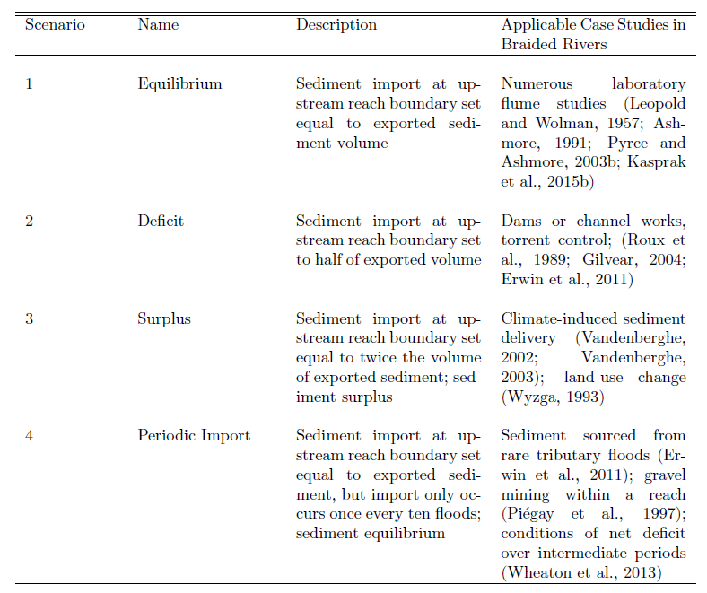

When the simulations finished, what we found was really interesting: of the four scenarios modeled, both Deficit and Surplus led to loss of the braided planform, either due to incision and transition to a single-thread system, or to widespread sheet deposition over the braidplain. However, both the Equilibrium and Periodic Import scenarios resulted in maintenance of the braided planform:

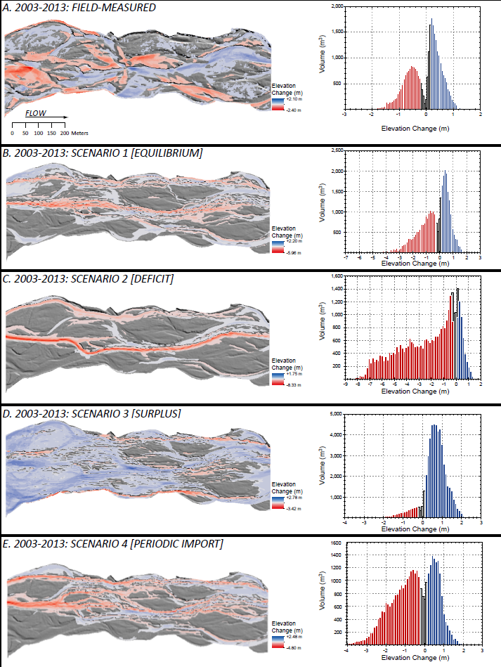

**Results of MoRPHED Modeling using the four scenarios described above on the River Feshie.**

Our initial results here suggest that while braided channels are really sensitive to the amount of sediment supplied (since just a twofold change in the amount of supply drastically altered channel planform), they might not be that sensitive to the timing with which that sediment is delivered, given that both the equilibrium and periodic scenarios maintained the planform.

I'm in the process of pursuing this work further. In particular, I'd like to examine the thresholds for channel change (i.e. what is the maximum interval with which sediment can be imported in the periodic scenario before the braided planform is lost). Additionally, I'd like to explore these analyses using historic and current field data by examining the co-evolution of sediment supply and channel planform following large floods and disturbances like land-use change, channelization, and dam construction on braided rivers. In the meantime, you can check out this study, which was a chapter of my dissertation, on my FigShare site.

What's next? I'm really interested in exploring ways that we can use this model to not only predict channel evolution, but also the co-evolution of physical habitat for bugs, fish, and many other organisms that live in rivers. I'd really like to couple an ecohydraulic model like PHABSIM or CASiMiR to MoRPHED and explore the effect of morphodynamics on habitat. Additionally, our morphodynamic model is idea for exploring the sensitivity of braided rivers to alterations in sediment or water supply, a concept we've already begun exploring with some scenario-based modeling. Finally, I'd really like to try this model out on single-thread rivers, too. It's been hypothesized that path-lengths hold up in both meandering and pool-riffle gravel bed streams, and I'm curious as to how well this modeling approach would work in those settings.

This research is supported by a grant from the National Science Foundation's Geomorphology and Land Use Dynamics Program and is in collaboration with James Brasington (University of Canterbury).